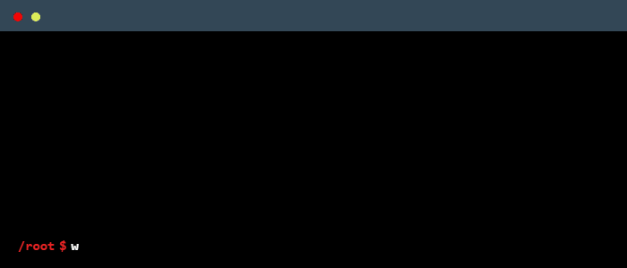

<h2 align="center">
  
  ᴀʙᴏᴜᴛ ᴍᴇ
  
</h2>

  

 

  

<h2 align="center">
  
  ᴛᴇᴄʜ ꜱᴛᴀᴄᴋ
  
</h2>

  <h3>🎓 ᴇᴅᴜᴄᴀᴛɪᴏɴ</h3>
  
  <!--   -->
  
  <!--  -->
  <!--  -->
  <!--  -->
  <!--  -->

  <h3>👨🏻‍💻 ʟᴀɴɢᴜᴀɢᴇꜱ & ꜱᴄᴍ</h3>
  

    
  

  <h3>🌐 ᴡᴇʙ & ᴅᴀᴛᴀʙᴀꜱᴇꜱ</h3>
  

    
  

  <h3>🛡️ ᴄʏʙᴇʀꜱᴇᴄᴜʀɪᴛʏ</h3>
  
  
  
  
  
  
  
  

<h2 align="center">
  
  ᴄᴇʀᴛɪꜰɪᴄᴀᴛɪᴏɴꜱ
  
</h2>

  <table style="width:100%; table-layout:fixed;">
    <colgroup>
      <col style="width:16.66%">
      <col style="width:16.66%">
      <col style="width:16.66%">
      <col style="width:16.66%">
      <col style="width:16.66%">
      <col style="width:16.66%">
    </colgroup>
    <!-- ICON ROW -->
    <tr>
      <td align="center">
        
      </td>
      <td align="center">
        
      </td>
      <td align="center">
        
      </td>
      <td align="center">
        
      </td>
      <td align="center">
        
      </td>
      <td align="center">
        
      </td>
    </tr>
    <!-- TEXT ROW -->
    <tr>
      <!-- Microsoft -->
      <td align="center" valign="top">
        🗓️ <em>Jan 2025</em> 
        🔗 <a href="https://learn.microsoft.com/api/credentials/share/es-es/victorkvor/C4660812A3E03193?sharingId=71E1E35FB8EC0B99">Credential</a> 
        <em>Security, compliance & identity fundamentals.</em>
      </td>
      <td align="center" valign="top">
        🗓️ <em>Dec 2024</em> 
        🔗 <a href="https://learn.microsoft.com/api/credentials/share/es-es/victorkvor/1807FC68F65E9A73?sharingId=71E1E35FB8EC0B99">Credential</a> 
        <em>Azure cloud concepts & core services.</em>
      </td>
      <td align="center" valign="top">
        🗓️ <em>Dec 2024</em> 
        🔗 <a href="https://learn.microsoft.com/api/credentials/share/es-es/victorkvor/4541D7C015FEDDF6?sharingId=71E1E35FB8EC0B99">Credential</a> 
        <em>AI & machine learning fundamentals.</em>
      </td>
      <td align="center" valign="top">
        🗓️ <em>Dec 2024</em> 
        🔗 <a href="https://learn.microsoft.com/api/credentials/share/es-es/victorkvor/8DD218C0AEFF4E3D?sharingId=71E1E35FB8EC0B99">Credential</a> 
        <em>Core data concepts & analytics.</em>
      </td>
      <td align="center" valign="top">
        🗓️ <em>Sep 2025</em> 
        🔗 <a href="https://cp.certmetrics.com/cisco/en/public/verify/credential/8af6b84c2a8d46f588fb530fa5e8c131">Credential</a> 
        <em>Networking, routing & switching fundamentals.</em>
      </td>
      <td align="center" valign="top">
        🗓️ <em>Dec 2024</em> 
        🔗 <a href="https://cp.certmetrics.com/cisco/en/public/verify/credential/af6e69cb1e7846a09d95ae7f20a02b00">Credential</a> 
        <em>Ethical hacking & attack methodologies.</em>
      </td>
    </tr>
  </table>

<h2 align="center">
  
  ɢɪᴛʜᴜʙ ꜱᴛᴀᴛꜱ
  
</h2>

   
   
  <picture>
    <source media="(prefers-color-scheme: dark)" srcset="https://raw.githubusercontent.com/victorkvor/victorkvor/output/pacman-contribution-graph-dark.svg">
    <source media="(prefers-color-scheme: light)" srcset="https://raw.githubusercontent.com/victorkvor/victorkvor/output/pacman-contribution-graph.svg">
    
  </picture>

---

  

